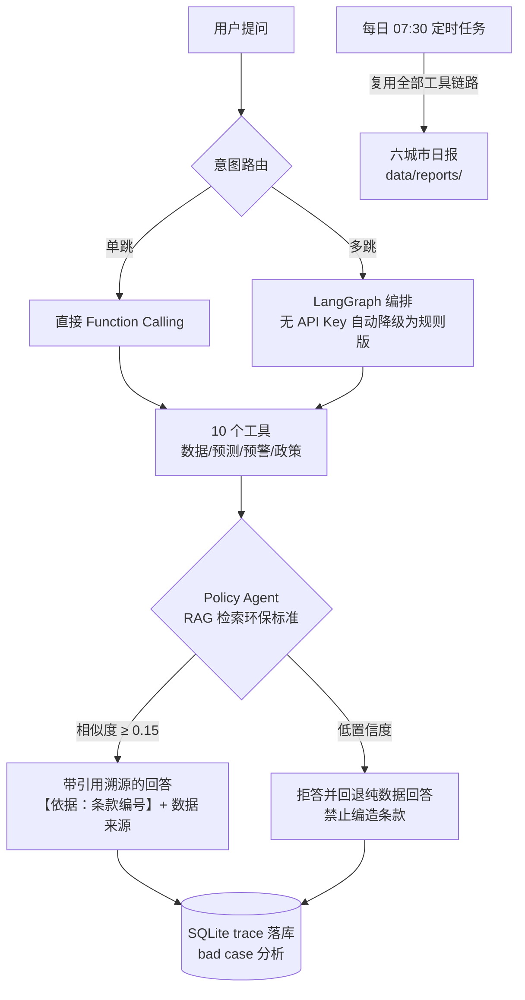

# 多城市空气质量监测 AI 系统 v2.1

> 一句话定位：**会调工具、会查标准、会拒答的环境问答 Agent** —— 工具调用 + RAG 的多跳问答系统，Function Calling + 引用溯源 + 全链路 trace 落库，零 LLM API 自动降级。

## 三个真实跑出的数字

| 指标 | 数值 | 出处 |
|---|---|---|
| 工具选择准确率 | **60/60 = 100%**（第一轮 80.0% → 迭代三轮至 100%） | [backend/evaluation/results.md](backend/evaluation/results.md) |
| Function Calling 工具 | **10 个**（数据/预测/预警/政策检索全覆盖） | `GET /api/agent/tools` |
| 问答全链路 trace | **100% 落库**（SQLite：prompt/响应/延迟/工具调用） | `GET /api/traces/stats` |

数据底座：6 城市 × 1 年 = **52,704 条**小时级记录（CAMS 再分析）。

## 架构图



## 目录结构

```
├── backend/
│   ├── main.py                      # FastAPI 唯一入口（v2.1，lifespan 托管日报调度）
│   ├── agents/
│   │   ├── orchestrator.py          # LangGraph LLM 版 Agent（含引用溯源提示词）
│   │   └── orchestrator_rule.py     # 规则版 Agent（零依赖降级，同享拒答/溯源）
│   ├── tools/
│   │   └── implementations.py       # 10 个 Tool 封装（Function Calling Schema）
│   ├── rag/
│   │   └── retriever.py             # 环保知识库检索（归一化打分 + 低置信拒答）
│   ├── evaluation/
│   │   ├── eval_agent.py            # 60 条工具选择准确率评测集
│   │   ├── eval_result.json         # 最新真实评测结果
│   │   └── results.md               # 评测报告（含三轮迭代记录）
│   ├── trace.py                     # 问答 trace 落库（SQLite，50 行自建）
│   ├── report.py                    # 每日日报生成 + threading 调度器
│   └── backend/                     # 原引擎（保留兼容）
│       ├── engine.py                # 数据分析 + 随机森林模型训练
│       ├── llm_chat.py              # FastGPT/Dify 接入
│       ├── realtime.py              # WAQI 实时数据
│       ├── weather_alerts.py        # 气象预警
│       ├── data/                    # 引擎数据目录（fetch_data.py 输出到此处）
│       └── models/                  # 预训练模型（可用 /api/model/train 重训）
├── data/
│   ├── trace.db                     # 问答 trace（自动创建）
│   └── reports/                     # 每日日报输出（自动创建）
├── static/
│   └── index.html                   # 深色看板前端（仪表盘/对比/预测/AI 问答）
├── fetch_data.py                    # 数据管道（Open-Meteo）
├── launcher.pyw                     # GUI 启动器（端口预检/崩溃日志/服务接管）
├── launcher.bat                     # Windows 双击启动 GUI
├── requirements.txt                 # 10 个真实依赖（已剔除未使用的重依赖）
├── Dockerfile
└── docker-compose.yml
```

## 核心亮点

### 1. 双模式 Agent

| 模式 | 触发条件 | 技术栈 | 用途 |
|------|---------|--------|------|
| **LLM Agent** | 配置 `LLM_API_KEY` | LangGraph + OpenAI 兼容 API | 展示大模型应用架构能力 |
| **规则 Agent** | 未配置 API Key（自动降级） | 正则 + 规则引擎 | 零依赖演示，任何环境直接跑 |

### 2. Function Calling Tool 体系（10 个）

| Tool | 功能 |
|------|------|
| `get_overview` | 城市空气质量概览 |
| `get_realtime` | WAQI 实时数据（未配置自动降级历史基座） |
| `get_forecast` | 未来 24h 预测预警 |
| `get_cities_comparison` | 6 城市对比 |
| `get_comprehensive_alerts` | 综合预警中心 |
| `get_alerts` | 当前超标告警（细粒度） |
| `get_season_analysis` | 季节分析 |
| `get_correlation` | 污染物相关性矩阵 |
| `train_models` | 训练预测模型 |
| `query_policy` | 环保标准/国标条款检索（RAG） |

### 3. 幻觉控制三层防线

1. **强制引用**：回答引用环保标准必须标注【依据：条款标题(编号)】，API 响应带 `references` 结构化溯源（标准条款 + 数据来源工具）；
2. **低置信拒答**：RAG 检索相似度低于阈值（0.15）直接拒答，明说"未检索到相关标准条款"，禁止编造条款编号；
3. **数据约束**：无检索场景回答只基于工具返回的结构化数据，不允许自由发挥。

### 4. trace 落库（可评测、可迭代）

每次问答自动写入 SQLite（`data/trace.db`）：问题、城市、模式、工具调用、回答、token 用量、延迟。bad case 用 SQL 直接捞，补进 few-shot 或规则分支后用 60 条回归集验证——本仓库的准确率迭代（80%→100%）就是这套流程的真实记录。

- 选型说明：不用 LangSmith/Phoenix，需要的是输入/输出/延迟/token 四个字段，50 行自建不引入外部依赖。

### 5. 每日日报（定时任务）

每天 07:30 自动生成六城市 Markdown 日报（`data/reports/YYYY-MM-DD.md`）：概览表、预警汇总、24h 超标风险、数据来源标注。调度器为 threading 守护线程（约 50 行自建，不引入 APScheduler），主线工具链路全部复用。

### 6. 评测体系（60 条回归集）

```bash
python backend/evaluation/eval_agent.py   # 结果写入 eval_result.json
```

迭代轨迹：**第一轮 48/60（80.0%）→ 第二轮 59/60（98.3%）→ 第三轮 60/60（100%）**。
第一轮 12 条 bad case（告警路由合并 / 训练意图缺失 / 政策工具缺口）全部修复并留作回归集，完整分析见 [backend/evaluation/results.md](backend/evaluation/results.md)。

## 快速开始

### 方式一：GUI 启动器（推荐）

**Windows**：双击 **`launcher.bat`** → 配置 API Key（可选）→「启动服务」→ 自动打开浏览器。

- 可视化配置：LLM（服务商/Key/模型/Base URL）、端口、WAQI Token（实时数据）、和风天气 Key（官方预警）
- 端口占用自动预检（已运行则直接接管打开浏览器，被占用则提示 PID）
- 任何启动崩溃写入 `launcher_error.log` 并在窗口直接显示，不再静默闪退
- 「测试 Agent」直达前端 AI 问答页签（`/#chat`）
- 未配置 API Key 时自动使用规则版 Agent，零 LLM 依赖

### 方式二：命令行

```bash
pip install -r requirements.txt
python fetch_data.py          # 拉取历史数据（Open-Meteo，免费无需 Key）
python -m uvicorn backend.main:app --host 127.0.0.1 --port 8000
```

### 方式三：Docker

```bash
docker-compose up --build
```

## 环境变量

```bash
# LLM（可选，不配置走规则版 Agent）
export LLM_API_KEY=sk-xxx
export LLM_BASE_URL=https://api.deepseek.com/v1   # DeepSeek；Qwen 用 dashscope 兼容地址
export LLM_MODEL=deepseek-chat

# 实时数据 / 官方预警（可选）
export WAQI_TOKEN=xxx
export QWEATHER_KEY=xxx
```

## API 接口

| 接口 | 说明 |
|------|------|
| `POST /api/chat/agent` | **Agent 智能问答（核心，含 references 溯源字段）** |
| `GET /api/agent/tools` | 可用工具列表 |
| `GET /api/traces?limit=` | 问答 trace 记录（bad case 分析） |
| `GET /api/traces/stats` | trace 统计（延迟/模式/工具频次） |
| `GET /api/report/daily?date=` | 每日日报（无则现场生成） |
| `POST /api/report/daily/generate` | 强制重新生成日报 |
| `GET /api/overview?city=` | 城市概览 |
| `GET /api/cities` | 城市对比 |
| `GET /api/alerts/forecast?city=&pollutant=` | 预测预警 |
| `GET /api/alerts/comprehensive?city=` | 综合预警 |
| `GET /api/health` | 健康检查 |

## 技术栈

- **Agent**：LangGraph（LLM 版）/ 规则引擎（降级版）
- **LLM**：DeepSeek / Qwen / OpenAI（OpenAI 兼容接口）
- **数据**：Pandas + Scikit-learn（随机森林）
- **API**：FastAPI
- **RAG**：归一化打分检索 + 相似度阈值拒答（千级条款规模下的轻量选型）
- **观测**：SQLite trace（50 行自建）
- **部署**：Docker + Docker Compose

## 可量化指标

| 指标 | 数值 |
|------|------|
| 工具选择准确率 | **100%**（60 条回归集，含 12 条易混淆样本；迭代轨迹 80%→100%） |
| Tool 数量 | 10 |
| 支持城市数 | 6 |
| 数据规模 | 52,704 条小时级记录 |
| 知识库条款 | 11 条（HJ 633-2012 / GB 3095-2012 等） |

## 后续扩展

- [ ] LLM 版 Agent 的 few-shot 迭代（bad case 从 trace.db 捞取 → 回归集验证）
- [ ] 日报 LLM 综述段落（当前模板化，配置 API Key 后自动启用）
- [ ] 多 Agent 并行执行优化
