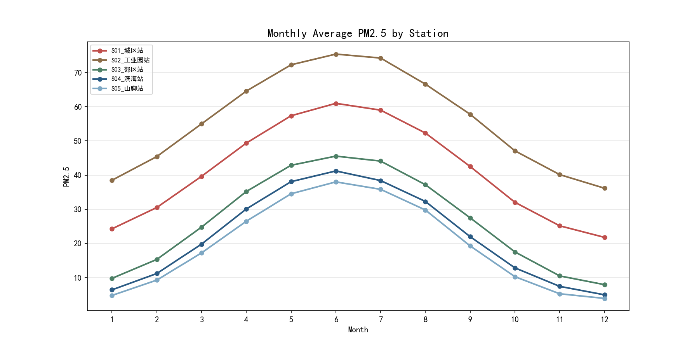
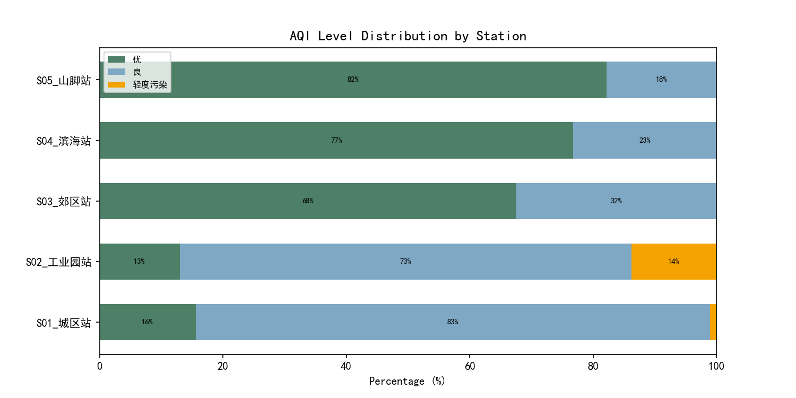
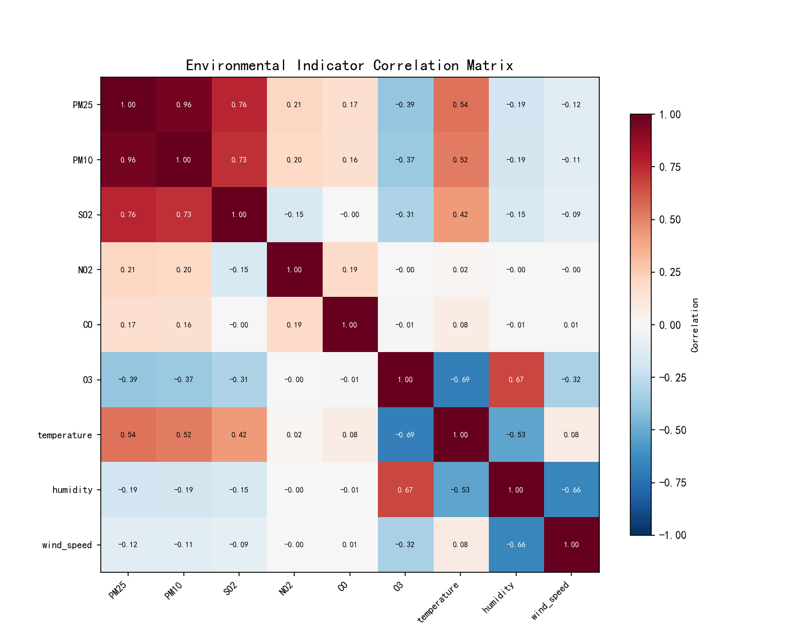
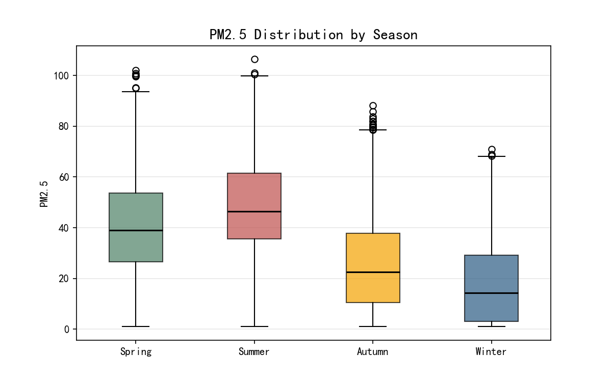
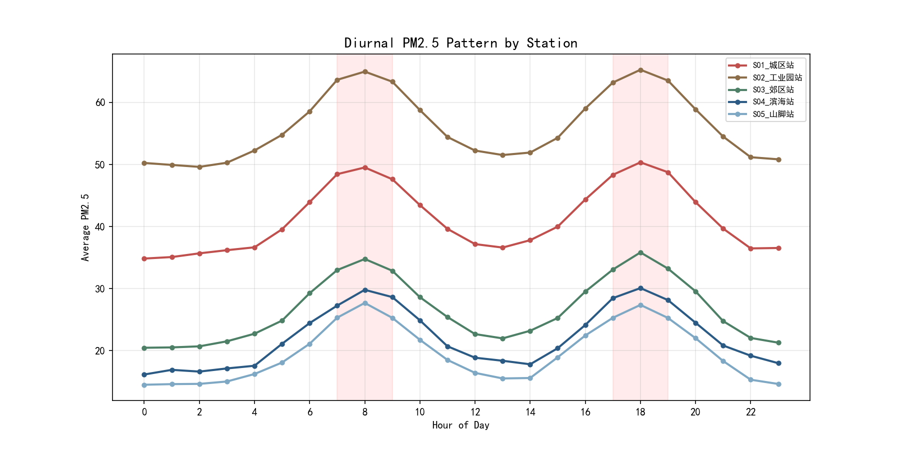
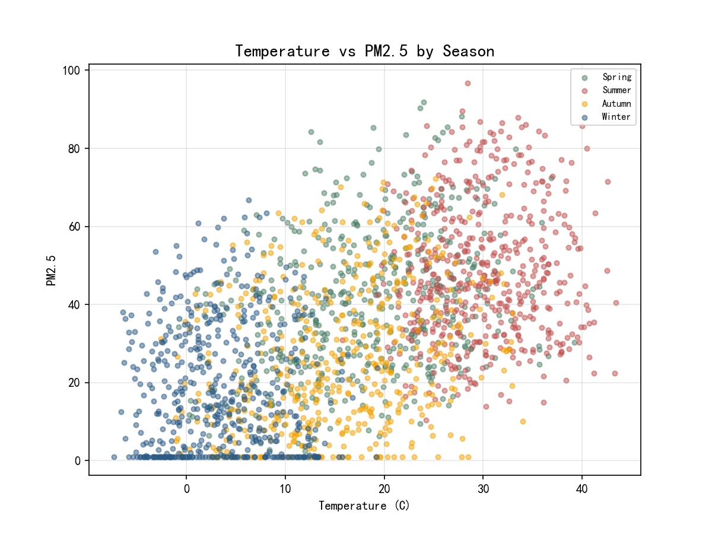

# 环境监测数据分析与 PM2.5 预测系统

针对 5 个监测站点、全年约 21 万条小时级环境监测数据，完成"数据分析 + 机器学习预测 + Web 服务"的完整实践：Pandas 数据清洗与多维分析、随机森林 PM2.5 预测模型、FastAPI 后端 + 前端页面的在线查询系统。

> 数据为程序生成的模拟监测数据（固定随机种子，不含真实环境数据），分析流程与真实业务一致。

## 系统功能

- **数据分析**：站点对比、AQI 等级分布、污染物相关性、季节 / 昼夜规律
- **PM2.5 预测**：随机森林回归模型，基于 PM10、SO2、NO2、CO、O3、气象因子及滞后/滚动特征（共 11 维），支持单条与批量预测
- **Web 服务**：FastAPI 提供 RESTful API（站点概览 / 相关性 / 预警 / 预测 / 图表数据），前端页面直接访问
- **智能问答**：内置规则式问答接口（`/api/chat`），可用自然语言查询 PM2.5、AQI 等统计结论

## 分析结论

- **站点差异显著**：工业园站 PM2.5 年均值最高（56.2 μg/m³，峰值 106.4），山脚站最低；城区站优良率 98.9%，工业园站仅 86.2%
- **空气质量整体良好**：全年 AQI"优"占 51.0%、 "良"占 46.1%，优良率约 97%，轻度污染仅 3.0%
- **特征重要性**：PM10 是 PM2.5 预测的最强特征（重要性 0.94），其次为 6 小时滚动均值（0.04）
- **污染规律**：存在明显的季节周期（冬季偏高）与昼夜双峰（早晚高峰）形态

## 成果展示

| PM2.5 月度走势 | AQI 等级分布 |
|---|---|
|  |  |

| 相关性热力图 | 季节箱线图 |
|---|---|
|  |  |

| 昼夜规律 | 温度-PM2.5 散点 |
|---|---|
|  |  |

## 项目结构

```
env-monitor-analysis/
├── main.py               # FastAPI 入口（API 路由 + 静态页面）
├── backend/
│   ├── engine.py         # 数据清洗、分析、建模、问答的核心逻辑
│   └── models/           # 训练好的模型（pm25_model.pkl）
├── analysis.py           # 离线分析脚本（清洗→相关性→建模→评估）
├── visualize.py          # 6 张分析图表生成
├── generate_data.py      # 模拟监测数据生成（5 站点 × 1 年 × 小时级）
├── static/index.html     # 前端页面
├── data/                 # 监测数据（约 21 万条）
└── output/               # 分析图表与结果 CSV
```

## 快速开始

```bash
pip install -r requirements.txt
python main.py          # 启动服务，浏览器打开 http://localhost:8000
```

离线复现分析流程：

```bash
python generate_data.py  # 重新生成数据（可选，data/ 已自带）
python analysis.py       # 离线分析与建模
python visualize.py      # 生成图表
```

## 主要 API

| 接口 | 说明 |
|---|---|
| `GET /api/overview` | 各站点监测概览 |
| `GET /api/season` | 季节分析 |
| `GET /api/correlation` | 污染物相关性矩阵 |
| `GET /api/aqi_distribution` | AQI 等级分布 |
| `GET /api/alerts` | 污染预警 |
| `POST /api/predict` / `POST /api/predict_batch` | PM2.5 单条 / 批量预测 |
| `GET /api/feature_importance` | 模型特征重要性 |
| `POST /api/chat` | 自然语言问答 |

## 工具

Python · Pandas / NumPy · Scikit-learn（随机森林）· FastAPI · Matplotlib

## License

MIT
